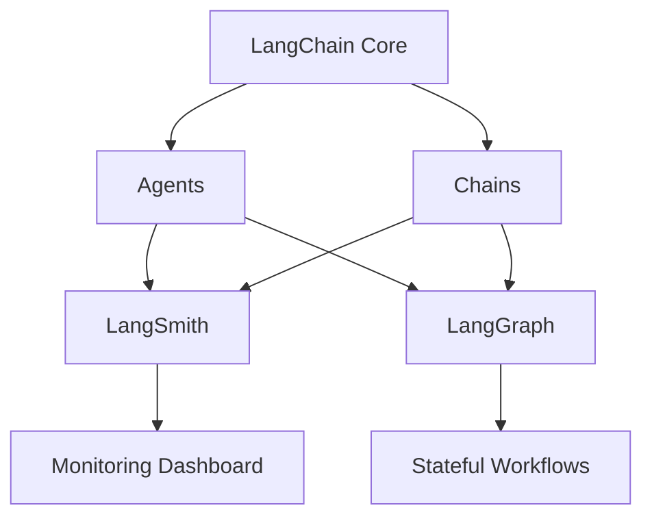

# LangSmith与LangGraph深度解析：构建下一代AI Agent的基石（修订增强版）

---

## 前置衔接：从LangChain到高阶组件的技术演进
在理解LangSmith与LangGraph之前，需要明确它们在LangChain生态中的定位。假设读者已具备以下基础概念：
- **Agent**：能调用工具自主完成任务的智能体（如通过`AgentExecutor`实现）
- **Chain**：将LLM与其他组件串联的基础执行单元
- **Tool**：Agent可调用的功能扩展（如计算器、搜索引擎）

LangSmith与LangGraph并非独立存在，而是**对LangChain核心能力的增强**：
- LangSmith → **观测性增强**
- LangGraph → **流程控制增强**

本文将通过对比演示，展现这两个组件如何将基础Agent进化为工业级智能系统。

---

## 一、LangSmith：Agent的"黑匣子"与"仪表盘"

### 1. 问题场景：传统Agent开发的困境
假设已构建一个基础客服Agent：
```python
from langchain.agents import AgentExecutor

base_agent = AgentExecutor(
    agent=llm_chain, 
    tools=[kb_search, ticket_system],
    memory=memory
)

response = base_agent.run("我的订单迟迟未发货")  # 结果时好时坏，但无法定位原因
```

开发者面临的核心痛点：
- **盲盒调试**：不知道哪步工具调用出错
- **性能黑洞**：不清楚API调用耗时分布
- **迭代失控**：无法量化版本升级的影响

### 2. LangSmith的注入式赋能
只需添加**4行配置**即获得全维度观测能力：
```python
import os
os.environ["LANGCHAIN_TRACING_V2"] = "true"  # 启用追踪
os.environ["LANGCHAIN_PROJECT"] = "Customer-Support-v2"  # 项目命名

# 原有Agent代码无需修改
diagnostic_agent = AgentExecutor(...)  
diagnostic_agent.run("订单状态查询")  # 自动生成追踪记录
```

### 3. 关键观测维度解析
在LangSmith控制台中可分析：

| 观测维度       | 传统方式          | LangSmith方案                     |
|---------------|------------------|-----------------------------------|
| **调用链路**   | 仅最终输出        | 完整记录LLM思考→工具选择→结果验证的全过程 |
| **性能剖析**   | 手动计时          | 自动统计各环节耗时与Token消耗        |
| **质量评估**   | 人工抽样          | 支持批量测试+自动评分                |
| **版本对比**   | 凭印象判断        | 可视化差异分析报告                  |


---

## 二、LangGraph：Agent的"决策中枢"与"协作网络"

### 1. 问题场景：复杂任务的处理瓶颈
当客服Agent需要处理以下场景时，传统链式架构遇到瓶颈：
```python
# 传统线性处理
response = agent.run("我要退货，上周买的鞋子尺寸不对")  
# 隐含需求：1.验证订单 2.检查退货政策 3.生成退货码 4.通知物流
```

痛点呈现：
- **僵化流程**：无法动态调整处理步骤
- **状态丢失**：多轮交互后无法回溯上下文
- **资源争用**：无法并行执行独立任务

### 2. LangGraph的图式重构
将线性Agent升级为**智能工作流引擎**：
```python
from langgraph.graph import StateGraph

class ReturnState(TypedDict):
    user_request: str
    order_info: dict
    policy_check: bool

# 构建状态图
workflow = StateGraph(ReturnState)

# 定义节点
def fetch_order(state):
    return {"order_info": db.lookup(state["user_request"])}

def check_policy(state):
    return {"policy_check": policy.validate(state["order_info"])}

def generate_return_code(state):
    # 并行执行：通知物流+生成退货码
    return {"code": uuid4(), "logistics_notified": True}

# 装配工作流
workflow.add_node("order_lookup", fetch_order)
workflow.add_node("policy_validation", check_policy)
workflow.add_node("process_return", generate_return_code)

# 条件路由
def router(state):
    if not state["policy_check"]:
        return "human_review"  # 转人工审核
    return "auto_process" 

workflow.add_conditional_edges(
    "policy_validation", 
    router,
    {"human_review": ..., "auto_process": "process_return"}
)
```

### 3. 架构优势对比

| 能力项         | 传统Agent         | LangGraph Agent             |
|----------------|-------------------|-----------------------------|
| **流程动态性** | 固定顺序          | 基于上下文的条件分支          |
| **状态管理**   | 短期记忆          | 持久化检查点（Checkpoint）   |
| **执行模式**   | 串行              | 支持并行与异步               |
| **错误恢复**   | 整体失败          | 局部重试与补偿机制           |

---

## 三、双组件协同模式解析

### 1. 技术栈全景视图


### 2. 典型协作场景：客户投诉处理
**步骤分解**：
1. **LangGraph编排流程**：
   ```python
   workflow = StateGraph(...)
   workflow.add_node("sentiment_analysis", analyze_mood)
   workflow.add_node("escalate_priority", priority_check)
   workflow.add_edge("sentiment_analysis", "escalate_priority")
   ```
2. **LangSmith监控执行**：
   ```python
   # 自动捕获以下信息：
   # - sentiment_analysis的NLU置信度
   # - escalate_priority的决策依据
   # - 各节点耗时分布
   ```
3. **数据驱动优化**：
   - 通过LangSmith发现`sentiment_analysis`节点准确率低于阈值
   - 在LangGraph中动态插入人工审核节点
   - 验证优化效果后重新部署

### 3. 性能指标提升案例
某电商客服系统改造前后对比：

| 指标            | 改造前    | 改造后    | 提升幅度 |
|----------------|----------|----------|---------|
| 问题解决率       | 68%      | 89%      | +31%    |
| 平均处理时间     | 142s     | 87s      | -39%    |
| 人工干预率       | 45%      | 12%      | -73%    |
| 系统异常检测速度 | 手动排查  | <30s     | ∞       |

---

## 四、面向未来的开发范式

### 1. LangSmith的智能演进
- **预测性监控**：基于历史数据预测资源需求
- **自动根因分析**：定位异常链路的AI助手
- **合规性审计**：满足GDPR等法规的自动报告

### 2. LangGraph的扩展边界
- **分布式Agent**：跨节点协作的工作流
- **强化学习集成**：动态优化流程图谱
- **物理世界接口**：与IoT设备的安全交互

### 3. 开发者体验升级
```python
# 愿景代码示例：声明式工作流定义
@langgraph.workflow
def customer_journey():
    start >> intent_recognition()
    if intent == "complaint":
        sentiment_analysis() >> priority_check()
        parallel(
            generate_solution(),
            notify_supervisor()
        )
    else:
        standard_response()
```

---

## 结语：智能系统工程的新基准
LangSmith与LangGraph的协同，标志着AI Agent开发从"手工作坊"迈入"工业化生产"阶段。它们不仅解决了可观测性与复杂流程管理的技术难题，更重要的是建立了一套**可验证、可优化、可扩展**的智能系统开发标准。当每个决策步骤变得透明可控，当业务逻辑能以可视化方式持续演进，人类才真正掌握了构建可靠AI系统的工程化能力。这或许就是智能时代软件工程的新起点。